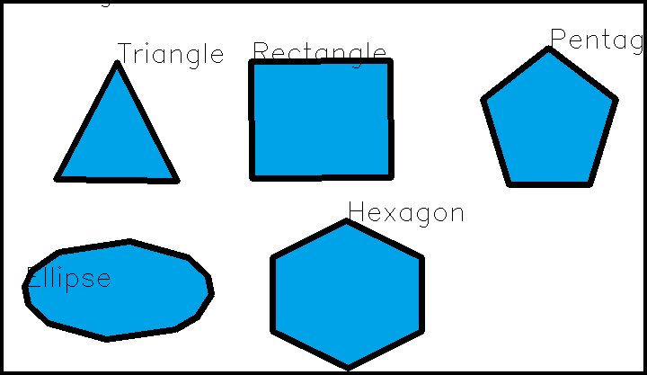
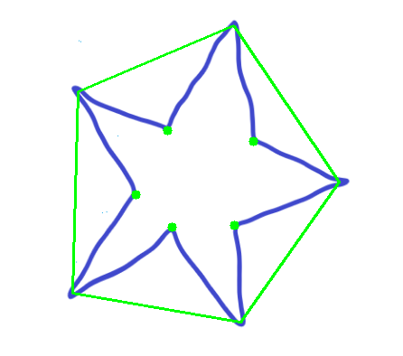
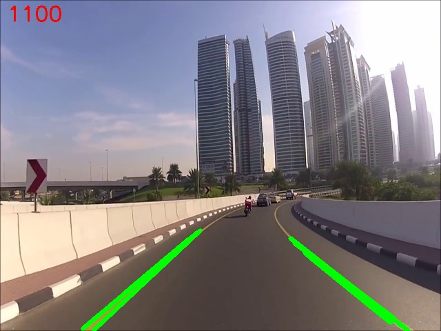
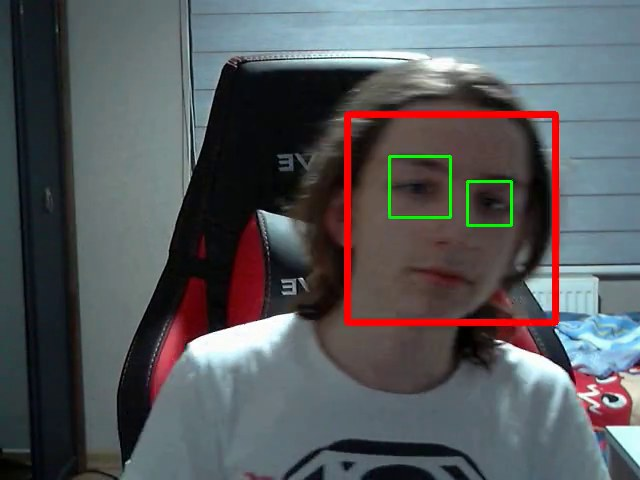
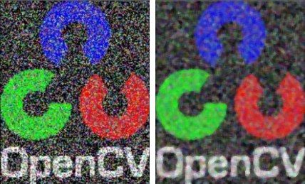
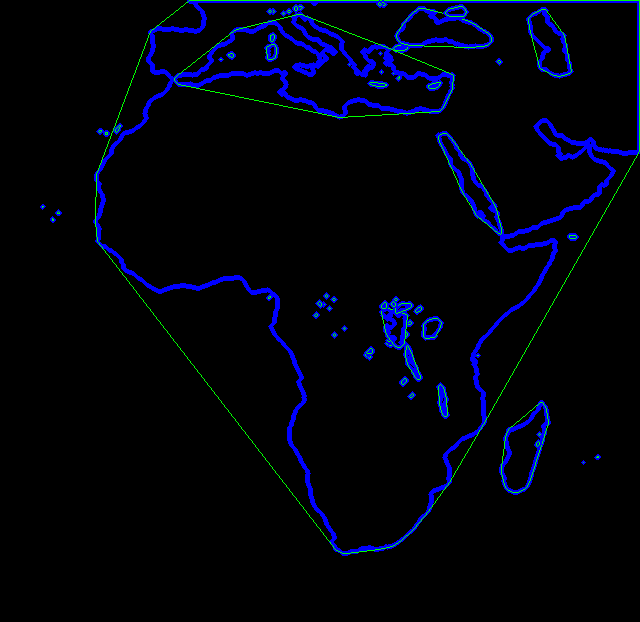
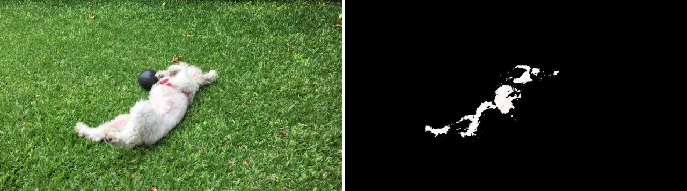

# OpenCV Fundamentals (2020)

31 Python scripts covering the OpenCV fundamentals, from reading and drawing on images to contour analysis, Hough transforms, Haar-cascade face detection and a DNN-based face mask detector.

This repository contains a collection of OpenCV exercises and experiments I built in high school (2020) while learning computer vision fundamentals through courses I was taking at the time. It was reorganized and cleaned up in 2026 for public release.

> TODO: add the course/resource that inspired this project

| Shape detection | Convexity defects | Lane detection |
|---|---|---|
|  |  |  |

| Face and eye detection | Median filter (before / after) | Convex hull |
|---|---|---|
|  |  |  |

## Features

The work is split into ten folders, in roughly the order I learned the topics.

### 01 - Basics

| Script | What it does | Main OpenCV functions |
|---|---|---|
| `check_installation.py` | Prints the installed OpenCV and NumPy versions | `cv2.__version__` |
| `read_show_save_image.py` | Loads an image as grayscale, shows it in a resizable window and saves it | `imread`, `namedWindow`, `imshow`, `imwrite` |
| `pixel_access.py` | Builds a 10x10 image, sets single pixels by index and upscales it to make them visible | NumPy indexing, `resize` |
| `resize_with_aspect_ratio.py` | Resizes an image to a target width or height without distorting it | `resize`, `INTER_AREA` |

### 02 - Drawing

| Script | What it does | Main OpenCV functions |
|---|---|---|
| `draw_shapes.py` | Draws lines, a rectangle, a circle, a triangle from line segments and a polygon | `line`, `rectangle`, `circle`, `polylines` |
| `draw_text.py` | Renders text with three Hershey font styles | `putText`, `LINE_AA` |

### 03 - Video input and output

| Script | What it does | Main OpenCV functions |
|---|---|---|
| `record_webcam.py` | Records the webcam to an AVI file with a mirrored live preview | `VideoCapture`, `VideoWriter`, `VideoWriter_fourcc`, `flip` |
| `read_video.py` | Plays back the recorded video frame by frame | `VideoCapture.read`, `waitKey` |
| `grayscale_video.py` | Plays the same video converted to grayscale | `cvtColor` |

### 04 - Color spaces

| Script | What it does | Main OpenCV functions |
|---|---|---|
| `color_space_conversion.py` | Shows one image in BGR, RGB, HSV and grayscale | `cvtColor` |
| `track_white_object.py` | Isolates a white dog in a video with an HSV threshold | `inRange`, `bitwise_and` |
| `hsv_color_mask_tuner.py` | Six trackbars for tuning lower and upper HSV bounds on a live webcam mask | `createTrackbar`, `getTrackbarPos`, `inRange` |



### 05 - Image arithmetic

| Script | What it does | Main OpenCV functions |
|---|---|---|
| `image_addition.py` | Adds two images with saturation at 255 | `add` |
| `weighted_addition.py` | Blends two images 50/50 | `addWeighted` |
| `bitwise_operations.py` | Combines two masks with a bitwise OR | `bitwise_or` |

### 06 - Smoothing

| Script | What it does | Main OpenCV functions |
|---|---|---|
| `smoothing_filters.py` | Compares averaging, Gaussian, median and bilateral filtering on noisy images | `blur`, `GaussianBlur`, `medianBlur`, `bilateralFilter` |

### 07 - Contours

| Script | What it does | Main OpenCV functions |
|---|---|---|
| `draw_contours.py` | Thresholds an image and draws one contour from the hierarchy | `threshold`, `findContours`, `drawContours` |
| `contour_area.py` | Prints the area of a contour | `contourArea` |
| `image_moments.py` | Finds the centroid of a shape from its moments | `moments` |
| `convex_hull.py` | Draws the contours of Africa from a satellite image together with their convex hulls | `convexHull` |
| `convexity_defects.py` | Marks the deepest points between the arms of a star | `convexHull(returnPoints=False)`, `convexityDefects` |
| `shape_detection.py` | Labels triangles, rectangles, pentagons, hexagons and ellipses by vertex count | `arcLength`, `approxPolyDP` |

### 08 - Hough transform

| Script | What it does | Main OpenCV functions |
|---|---|---|
| `hough_lines.py` | Detects straight line segments in an image | `Canny`, `HoughLinesP` |
| `lane_detection_video.py` | Detects yellow lane markings in dashcam footage by masking in HSV, then running Canny and Hough | `inRange`, `Canny`, `HoughLinesP` |
| `circle_detection.py` | Detects coins and balls as circles | `medianBlur`, `HoughCircles` |

### 09 - Face detection

| Script | What it does | Main OpenCV functions |
|---|---|---|
| `face_eye_detector.py` | Shared detector: finds faces, then searches for eyes only inside each face | `CascadeClassifier`, `detectMultiScale` |
| `face_eye_detection_webcam.py` | Live face and eye detection on the webcam | |
| `face_eye_detection_image.py` | Runs the detector on a photo and saves the result | |
| `face_eye_detection_video.py` | Runs the detector on every frame of two videos and writes the annotated videos | |

The `*_detection` files in `09-face-detection/media/` are the original outputs generated in 2020.

### 10 - Face mask detection

| Script | What it does | Main OpenCV functions |
|---|---|---|
| `mask_detection_haar.py` | Rule-based approach: a detected face with no detected lips inside it is treated as masked. A thresholded black-and-white frame is also checked, because a white mask can hide the face from the grayscale detector | `CascadeClassifier`, `threshold` |
| `mask_detection_dnn.py` | Finds faces with a ResNet-10 SSD Caffe model, then classifies each face with a MobileNetV2 Keras model. Adapted from [chandrikadeb7/Face-Mask-Detection](https://github.com/chandrikadeb7/Face-Mask-Detection) | `dnn.readNet`, `dnn.blobFromImage` |

`dataset/` contains the 3,833 labelled images (1,915 with a mask, 1,918 without) used to train the classifier.

## Tech stack

- Python 3
- OpenCV 4.10 (`opencv-python`)
- NumPy
- imageio with imageio-ffmpeg, for reading and writing video in the face detection scripts
- TensorFlow/Keras and imutils, only for `mask_detection_dnn.py`

## Installation

```bash
git clone https://github.com/ozanulassivaci/opencv-fundamentals-2020.git
cd opencv-fundamentals-2020
python -m venv venv
```

Activate the environment. On Windows:

```bash
venv\Scripts\activate
```

On Linux or macOS:

```bash
source venv/bin/activate
```

Then install the dependencies:

```bash
pip install -r requirements.txt
```

`mask_detection_dnn.py` additionally needs TensorFlow and imutils:

```bash
pip install tensorflow imutils
```

## Usage

Every script uses paths relative to its own folder, so run it from inside that folder:

```bash
cd 07-contours
python shape_detection.py
```

Image scripts wait for a key press. Video and webcam scripts stop when you press `q`; `track_white_object.py` stops on `Esc`.

## Project structure

```
.
├── 01-basics/              image I/O, pixel access, resizing
├── 02-drawing/             shapes and text
├── 03-video-io/            webcam recording and video playback
├── 04-color-spaces/        color conversions and HSV masking
├── 05-image-arithmetic/    add, addWeighted, bitwise operations
├── 06-smoothing/           blur, Gaussian, median, bilateral filters
├── 07-contours/            contours, moments, convex hull, shape detection
├── 08-hough-transform/     line, lane and circle detection
├── 09-face-detection/      Haar-cascade face and eye detection
├── 10-mask-detection/      Haar and DNN face mask detection
│   ├── dataset/            with_mask/ and without_mask/ training images
│   └── face_detector/      ResNet-10 SSD Caffe model
├── haarcascades/           Haar cascade XML files shared by 09 and 10
└── docs/images/            screenshots used in this README
```

Each topic folder keeps its input images and videos in a `media/` subfolder.

## Limitations

- `mask_detection_dnn.py` does not run as-is: it needs a trained `mask_detector.model` file, which is not included. The script exits with a message if the file is missing. A model can be trained on `dataset/` with the training script from the upstream repository.
- The TensorFlow and imutils versions for `mask_detection_dnn.py` are not pinned and were not tested during the 2026 cleanup.
- `circle_detection.py` produces many false positives on `coins.jpg` with the original parameters (`param2=10`).
- The Haar-based mask detector depends heavily on lighting; `bw_threshold` usually needs adjusting between 80 and 105.
- `record_webcam.py`, `face_eye_detection_image.py` and `face_eye_detection_video.py` overwrite the stored media files in their folders when run.
- `highway_lanes.mp4` was re-encoded from 1080p to 720p to stay under GitHub's 100 MB file limit. The lane detection script resizes frames to 640x480, so the output is unchanged.

## License

The code is released under the [MIT License](LICENSE).

The following bundled files are not covered by it:

- The Haar cascades and the ResNet-10 SSD face detector come from the OpenCV project and keep their original licenses.
- The mask dataset comes from [chandrikadeb7/Face-Mask-Detection](https://github.com/chandrikadeb7/Face-Mask-Detection).
- The portrait photos, the portrait video and the dashcam and dog footage are third-party media, used here only as test inputs.
